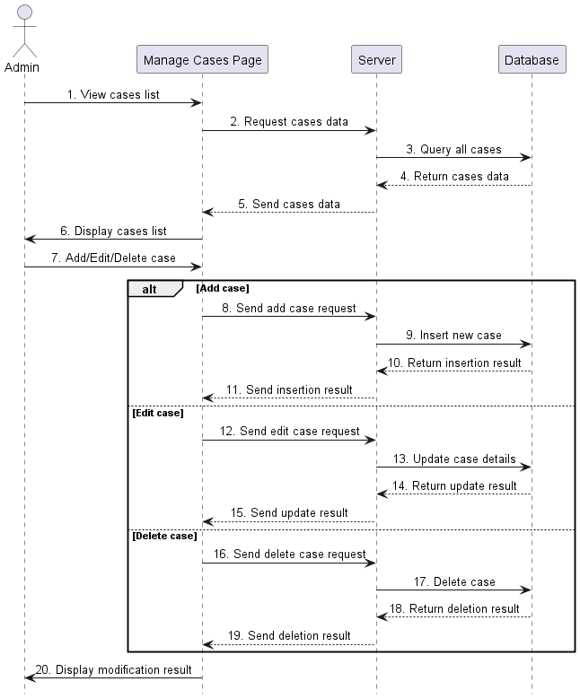
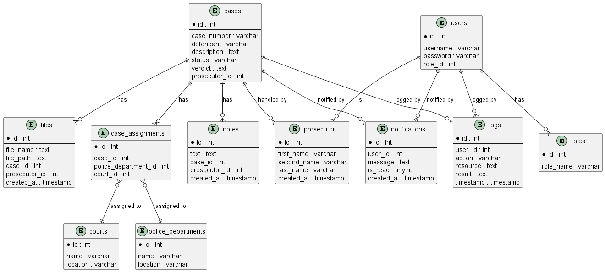
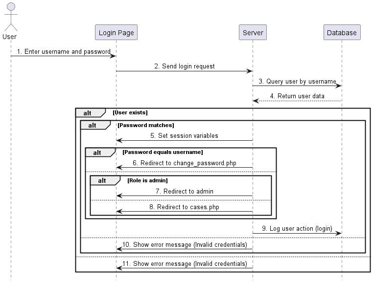
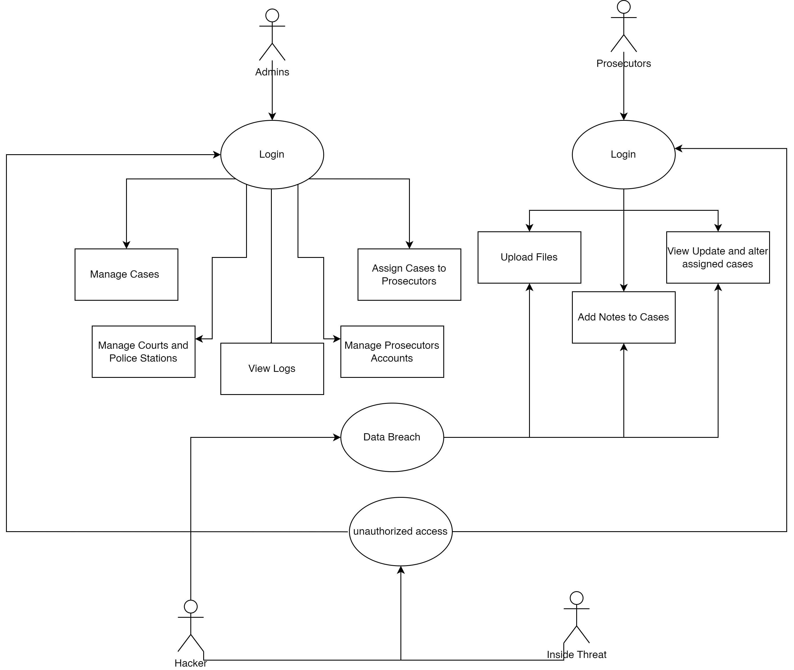
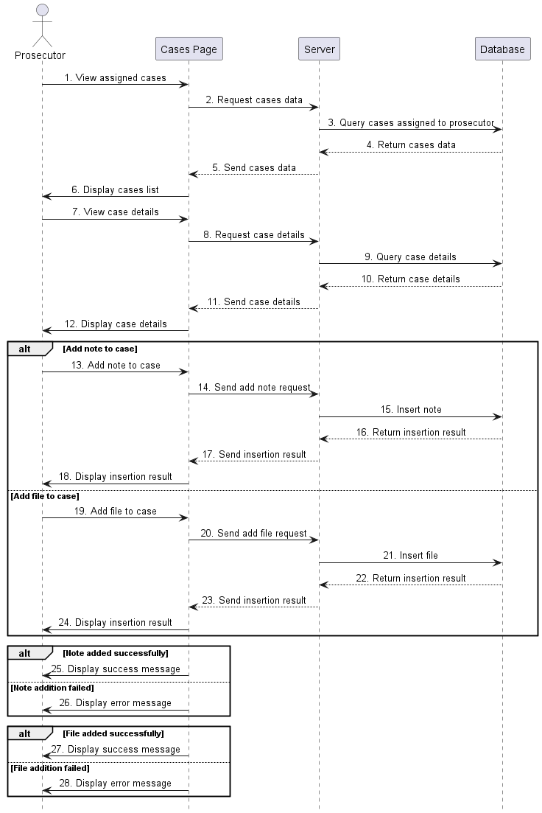
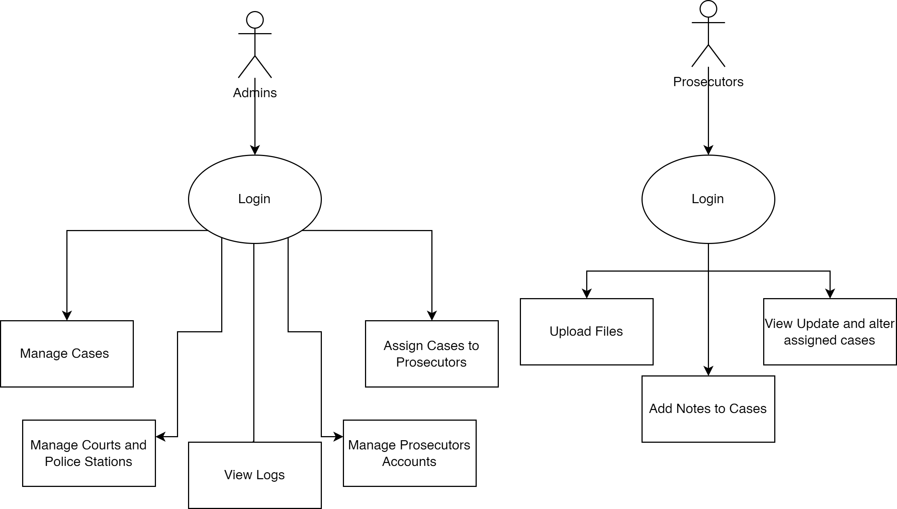
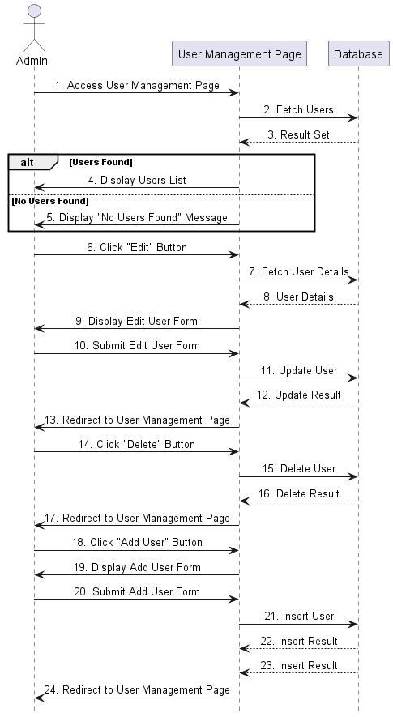

# ⚖️ Prosecutors Office System  
🚀 A part of the **Judge Software** created by **Laila Alshibami** using PHP.  

## 📌 Overview  
The **Prosecutors Office System** is a secure web application designed to manage legal cases, track case progress, and streamline the workflow for prosecutors and legal staff.  

## 🖼️ Screenshots  
### 🗂️ Case Management  
Manage legal cases efficiently with an intuitive interface.  
  

### 🏛️ Database Structure  
A well-structured database ensuring data integrity.  
  

### 🔐 Login Page  
Secure authentication for prosecutors and legal staff.  
  

### 🚨 Misuse Detection  
Monitor and log any unauthorized activities.  
  

### ⚖️ Prosecutor Case Details  
View and manage cases assigned to specific prosecutors.  
  

### 📊 Use Case Diagram  
Visual representation of system interactions.  
  

### 👤 User Management  
Manage prosecutors, clerks, and administrators.  
  

## ✨ Features  
✅ **Authentication & Authorization** – Secure login system with role-based access.  
✅ **Case Management** – CRUD operations for cases, defendants, and legal documents.  
✅ **User Roles** – Assign roles for prosecutors, clerks, and administrators.  
✅ **Audit Logs** – Track every system activity for transparency.  
✅ **Security Features** – CSRF protection, input validation, and access control.  
✅ **Modern UI/UX** – Clean and intuitive design for easy navigation.  

## 🏗️ Project Structure  
prosecutors-office/ │── src/ # PHP source code │── public/ # Public assets (CSS, JS, images) │── config/ # Configuration files │── database/ # Database schema and migrations │── tests/ # Unit and integration tests │── docs/ # Documentation │── .gitignore # Git ignore file │── README.md # Project overview │── LICENSE # License file │── composer.json # PHP dependencies │── .env.example # Environment configuration


## 🚀 Installation  
1. **Clone the Repository**  
   ```sh
   git clone https://github.com/LAILA-550/Prosecutors-office.git
   cd prosecutors-office
2. **Install Dependencies**
    ```sh
     composer install
4. **Run Migrations**
     ```sh
     php artisan migrate
6. **Access the application**
    Open http://localhost:8000 in your browser.

   
🛠️ Tech Stack
Backend: PHP (Laravel or Custom Framework)
Frontend: HTML, CSS, JavaScript
Database: MySQL / PostgreSQL
Security: JWT Authentication, CSRF Protection
🔒 Security Best Practices
⚠️ Change default credentials after installation.
⚠️ Keep your .env file secret.
⚠️ Run security audits regularly.


🤝 Contributing
👥 We welcome contributions! Feel free to submit issues or pull requests.

